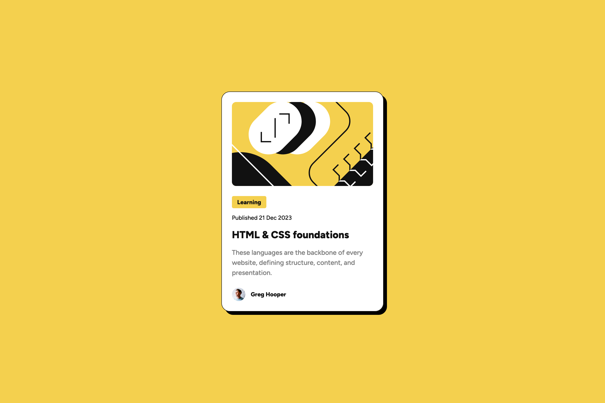
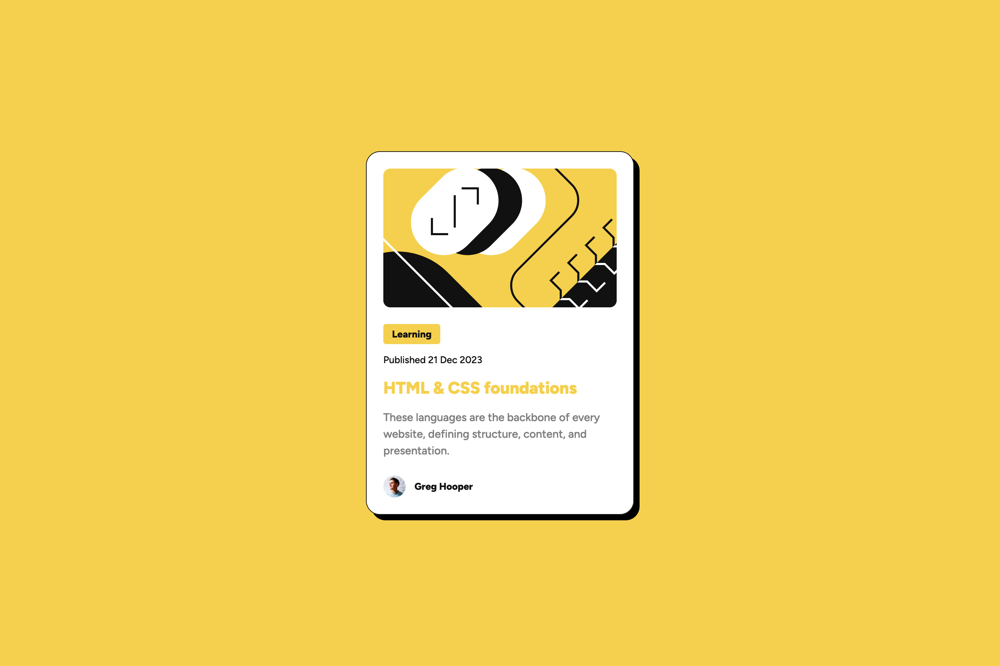
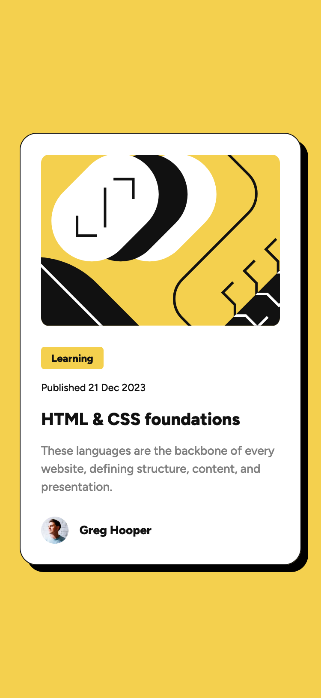

# Frontend Mentor - Blog preview card solution

This is a solution to the [Blog preview card challenge on Frontend Mentor](https://www.frontendmentor.io/challenges/blog-preview-card-ckPaj01IcS). Frontend Mentor challenges help you improve your coding skills by building realistic projects.

## Table of contents

- [Overview](#overview)
  - [The challenge](#the-challenge)
  - [Screenshot](#screenshot)
  - [Links](#links)
- [My process](#my-process)
  - [Built with](#built-with)
  - [What I learned](#what-i-learned)
  - [Useful resources](#useful-resources)
- [Author](#author)

## Overview

### The challenge

Users should be able to:

- See hover and focus states for all interactive elements on the page

### Screenshot

### Links

- Solution URL: [solution URL](https://github.com/jaceleedev/blog-preview-card)
- Live Site URL: [live site URL](https://jaceleedev.github.io/blog-preview-card)

## My process

### Built with

- HTML5
- CSS3
- Figma Design

### What I learned

css grid를 학습하고 사용해보는 시간을 가졌다. grid는 2차원을 다루기 때문에, 전체적인 레이아웃을 설정하는 데 좋다고 배웠다. 이번 프로젝트는 레이아웃이 복잡하지 않아서, 꼭 grid를 사용하지 않아도 괜찮았다. 그렇지만 막상 사용해보니, 굉장히 편리하고 좋았다.

### Useful resources

- [css grid guide](https://css-tricks.com/snippets/css/complete-guide-grid/) - css tricks의 가이드다. css flexbox 가이드처럼 잘 만들어져있다.
- [1분코딩 css grid](https://studiomeal.com/archives/533) - css grid를 이해하기 쉽게 설명해준다. 한국어로 되어있기 때문에 더 쉽게 읽을 수 있다.
- [GRID GARDEN](https://cssgridgarden.com/#ko) - css grid를 연습할 수 있는 게임이다. 실제로 레이아웃을 만들기 전에 배운 지식을 연습해볼 수 있다.

## Author

- Github - [Jaceleedev](https://github.com/jaceleedev)
- Frontend Mentor - [jaceleedev](https://www.frontendmentor.io/profile/jaceleedev)
