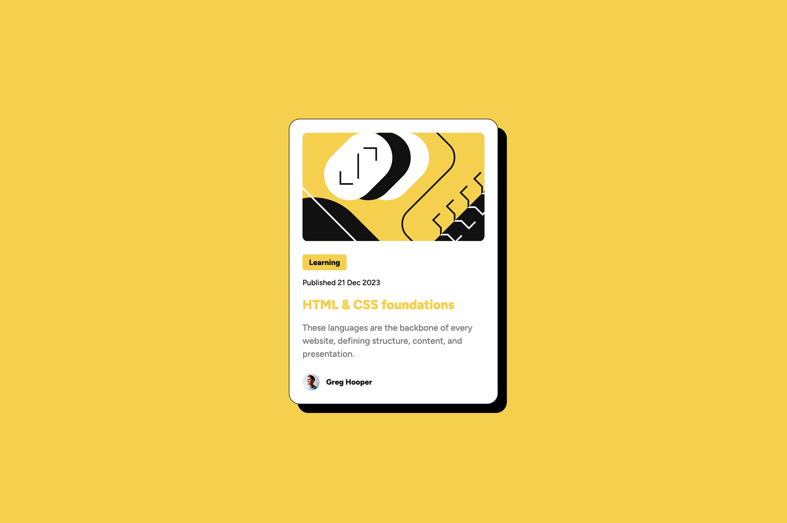
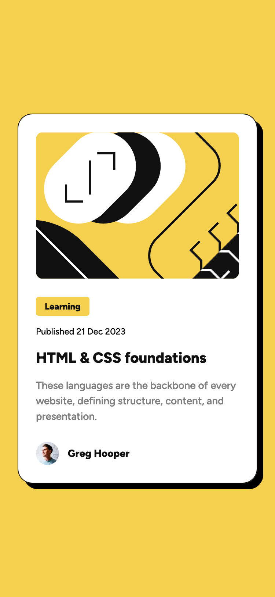

# Frontend Mentor - Blog preview card solution

This is a solution to the [Blog preview card challenge on Frontend Mentor](https://www.frontendmentor.io/challenges/blog-preview-card-ckPaj01IcS). Frontend Mentor challenges help you improve your coding skills by building realistic projects.

## Table of contents

- [Overview](#overview)
  - [The challenge](#the-challenge)
  - [Screenshot](#screenshot)
  - [Links](#links)
- [Getting Started](#getting-started)
  - [Prerequisites](#prerequisites)
  - [Installation](#installation)
- [My process](#my-process)
  - [Built with](#built-with)
  - [What I learned](#what-i-learned)
  - [Continued development](#continued-development)
  - [Useful resources](#useful-resources)
- [Author](#author)

## Overview

### The challenge

Users should be able to:

- See hover and focus states for all interactive elements on the page

### Screenshot





### Links

- Solution URL: [https://www.frontendmentor.io/solutions/blog-preview-card-with-nextjs-tailwind-css-css-module-hiCGksj0Ss](https://www.frontendmentor.io/solutions/blog-preview-card-with-nextjs-tailwind-css-css-module-hiCGksj0Ss)
- Live Site URL: [https://blog-preview-card-omega-self.vercel.app/](https://blog-preview-card-omega-self.vercel.app/)

## Getting Started

To get a local copy up and running follow these simple steps:

### Prerequisites

Make sure you have the following software installed on your machine:

- [Node.js](https://nodejs.org/) (Node.js 18.17 or later)
- [pnpm](https://pnpm.io/)

### Installation

1. Clone the repository:

   ```sh
   git clone https://github.com/jaceleedev/blog-preview-card.git
   ```

2. Navigate to the project directory:

   ```sh
   cd blog-preview-card
   ```

3. Install dependencies using pnpm:

   ```sh
   pnpm install
   ```

4. Start the development server:

   ```sh
   pnpm dev
   ```

5. Open your browser and visit http://localhost:3000 to view the project.

## My process

### Built with

- Next.js (v14.2.5)
- TypeScript (v5)
- Tailwind CSS (v3.4.1)
- CSS Modules
- CSS BEM methodology
- CSS custom properties
- Semantic HTML5 markup
- SEO & web accessibility

### What I learned

During this project, I enhanced my skills in using Next.js and Tailwind CSS. I learned how to effectively combine CSS Modules with Tailwind CSS for scoped and utility-first styling. I also gained a better understanding of semantic HTML and web accessibility practices. This project represents my solution to the ongoing debate about how to effectively use and manage CSS in modern web development. By integrating Tailwind CSS with CSS Modules and employing the BEM methodology, I have developed a structured approach to styling components. This method allows for scalable, maintainable, and highly readable code.

#### Code snippets:

```html
<!-- import styles from './Component.module.css' -->
<h1 className="{styles.my-header}">Some HTML code</h1>
```

```css
/* CSS Module */
.my-header {
  @apply text-primary font-bold;
}
```

### Continued development

In future projects, I plan to continue focusing on responsive design and component-based architecture. I aim to deepen my understanding of Next.js and Tailwind CSS while further enhancing the accessibility of my web applications. My goal is to create more efficient, user-friendly, and accessible web experiences.

### Useful resources

- [Next.js Documentation](https://nextjs.org/docs) - Comprehensive guide to Next.js features and API.
- [Tailwind CSS Documentation](https://tailwindcss.com/docs/installation) - Detailed documentation for Tailwind CSS.

## Author

- GitHub - [@jaceleedev](https://github.com/jaceleedev)
- Frontend Mentor - [@jaceleedev](https://www.frontendmentor.io/profile/jaceleedev)
